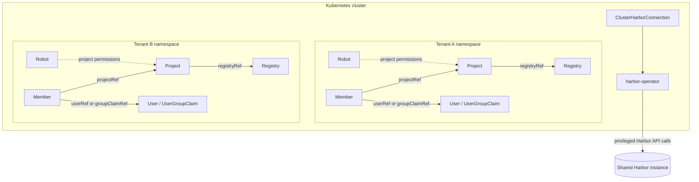

# Multi-Tenancy

This page describes the recommended multi-tenant operating model for
`harbor-operator`.

The short version is:

- remember that Kubernetes namespaces do not create namespaces inside Harbor
- use operator settings for connection and reference boundaries
- use Kubernetes object references between Harbor resources
- expose only the resource kinds tenants are intended to control
- use admission policy such as Kyverno for naming, reference, Secret, and scope rules

## Tenant Resource Boundaries

The operator acts on Harbor with the credentials from the selected connection.
Kubernetes RBAC controls who can submit desired state, but the operator performs
the resulting Harbor API call with its own privileges. Admission policy must
therefore prevent a tenant CR from making the operator act on another tenant's
Harbor objects or read another namespace's Secrets.



The Harbor box is outside the Kubernetes boundary to show the API boundary; the
Harbor instance may run in the same cluster or elsewhere. The two tenant boxes
show the same pattern: a `UserGroupClaim` in each namespace may refer to the
same global Harbor group, while each `Member` still grants access only to its
own tenant's projects.

The policy boundary should enforce at least:

- tenant-specific names for Harbor-global objects such as projects, registries,
  robots, and local users
- same-namespace references for tenant-owned projects, registries, users, user
  groups, and related policy objects
- same-namespace Secret references so the operator cannot become a credential-reading
  confused deputy
- project-only robot permissions constrained to the tenant's projects
- an allowlist of tenant-manageable CR kinds; Harbor-instance configuration,
  global schedules, scanners, and other administrative resources should remain
  platform-owned unless separately constrained
- deletion behavior whose Harbor-side blast radius is acceptable for tenant use

### Harbor-global identity lifecycle

`User` and `UserGroupClaim` CRs are namespaced Kubernetes objects, but Harbor
users and user groups are global to a Harbor instance. A `UserGroupClaim` is
non-owning because deleting a global Harbor UserGroup also removes every project
membership for that group. Multiple tenants may safely claim the same external
OIDC group and grant it roles only in their own projects.

OIDC needs particular care: `UserGroupClaim.spec.groupName` is commonly the
identity provider's group ID, so a tenant prefix on `metadata.name` does not
make the underlying Harbor group identity tenant-local. The claim name is only a
Kubernetes reference identity; the operator never deletes or changes the shared
Harbor group and blocks claim deletion while active Members still reference it.

## Recommended Model

For a shared cluster, the cleanest setup is usually:

1. Point that operator instance at a single shared Harbor instance with `--harbor-connection`.
2. Use `metadata.name` as the Harbor-side identity for named resources where it
   matches Harbor's model; `UserGroupClaim.spec.groupName` is the notable exception.
3. Use Kubernetes object references for relationships between Harbor resources.
4. Enforce tenant-specific naming conventions with admission policy such as Kyverno.

This keeps the operator focused on reconciliation while leaving tenant naming
policy to the cluster policy layer.

## Operator Controls

The operator exposes two runtime controls that are useful in multi-tenant
deployments.

### `--harbor-connection`

Use `--harbor-connection=shared-harbor` to force all Harbor-backed resources to
use one `ClusterHarborConnection`.

In this mode:

- `spec.harborConnectionRef` becomes optional
- if `spec.harborConnectionRef` is still set, it must match the configured
  `ClusterHarborConnection`
- updates to that `ClusterHarborConnection` fan out reconciles to dependent
  Harbor-backed resources

This is useful when one operator instance is intended to manage exactly one
Harbor installation.

### `--allow-cross-namespace-references`

This flag defaults to `true` so a normal installation can compose resources
across namespaces. Set it to `false` for a tenant-scoped operator. In that mode,
namespaced resources may reference only Projects, Registries, Users,
UserGroupClaims, and Secrets in their own namespace. Cluster-scoped connection
objects may still reference their explicitly named Secrets.

This is a generic trust-boundary control. Tenant-specific naming, allowed CR
kinds, robot scopes, and project permissions remain admission-policy concerns.

### Resolved connection binding

After a Harbor-backed resource first selects a connection, its status records the
connection kind, name, namespace, and Kubernetes UID. If a later reconcile would
resolve a different connection, the operator reports `HarborConnectionChanged`
and performs no Harbor mutation or deletion. This prevents a changed reference,
forced connection, or deleted-and-recreated connection with the same name from
being interpreted as ownership of an existing Harbor object.

## API Shape for Tenant Safety

The operator API now leans toward a simpler, safer model:

- `metadata.name` is the Harbor identity for named resources such as `Project`,
  `Registry`, `User`, `Label`, `Robot`, `ReplicationPolicy`,
  `ScannerRegistration`, and `WebhookPolicy`
- `UserGroupClaim.metadata.name` is the Kubernetes reference identity, while
  `UserGroupClaim.spec.groupName` is the exact Harbor group name or external identity
  provider group ID
- `UserGroupClaim` is a non-owning, reusable claim. It ensures the global Harbor
  UserGroup exists, but never deletes or updates the shared group identity.
- relationships use Kubernetes object references such as `projectRef`,
  `registryRef`, `memberUser.userRef`, and `memberGroup.groupClaimRef`
- CRDs do not expose raw Harbor ID selectors or `nameOrID` union fields

This improves tenant isolation because references resolve through Kubernetes
objects and their status rather than through free-form Harbor identifiers.

## What Belongs in Policy

Tenant-specific naming rules usually belong outside the operator.

Examples include:

- requiring project names to start with a tenant prefix
- requiring user names to start with a tenant prefix
- requiring referenced objects and Secrets to stay in the tenant namespace
- restricting robots to project-scoped permissions for tenant-owned projects
- restricting which CR kinds tenants may create at all

Those are cluster governance concerns, not Harbor reconciliation concerns.

Kyverno or a similar admission policy engine is a good fit because:

- bad objects are rejected at admission time
- the policy can derive prefixes from namespace labels
- the rule can be changed per cluster without changing the operator

## Example Kyverno Policies

The examples below assume:

- tenant identity is stored on a namespace label named
  `example.com/tenant` (a placeholder for your platform's label key)
- the tenant prefix is exactly the value of that label; the policy does not
  transform or derive it from the namespace name

Replace `example.com/tenant` with the label key used by your platform. The
examples intentionally use only the label value as the prefix, so they do not
depend on a particular namespace controller or tenant naming convention.

### Enforce Project Name Prefix

```yaml
apiVersion: kyverno.io/v1
kind: ClusterPolicy
metadata:
  name: harbor-project-prefix
spec:
  validationFailureAction: Enforce
  background: false
  rules:
    - name: validate-project-metadata-name-prefix
      match:
        any:
          - resources:
              kinds:
                - harbor.harbor-operator.io/v1alpha1/Project
      context:
        - name: tenantName
          apiCall:
            urlPath: "/api/v1/namespaces/{{request.object.metadata.namespace}}"
            jmesPath: 'metadata.labels."example.com/tenant" || `""`'
      preconditions:
        all:
          - key: "{{ request.operation }}"
            operator: AnyIn
            value: ["CREATE", "UPDATE"]
          - key: "{{ tenantName }}"
            operator: NotEquals
            value: ""
      validate:
        message: "Harbor Project metadata.name must start with '{{tenantName}}-'"
        deny:
          conditions:
            any:
              - key: "{{ regex_match('^{{tenantName}}-.*', request.object.metadata.name) }}"
                operator: Equals
                value: false
```

### Enforce User Name Prefix

```yaml
apiVersion: kyverno.io/v1
kind: ClusterPolicy
metadata:
  name: harbor-user-prefix
spec:
  validationFailureAction: Enforce
  background: false
  rules:
    - name: validate-user-metadata-name-prefix
      match:
        any:
          - resources:
              kinds:
                - harbor.harbor-operator.io/v1alpha1/User
      context:
        - name: tenantName
          apiCall:
            urlPath: "/api/v1/namespaces/{{request.object.metadata.namespace}}"
            jmesPath: 'metadata.labels."example.com/tenant" || `""`'
      preconditions:
        all:
          - key: "{{ request.operation }}"
            operator: AnyIn
            value: ["CREATE", "UPDATE"]
          - key: "{{ tenantName }}"
            operator: NotEquals
            value: ""
      validate:
        message: "Harbor User metadata.name must start with '{{tenantName}}-'"
        deny:
          conditions:
            any:
              - key: "{{ regex_match('^{{tenantName}}-.*', request.object.metadata.name) }}"
                operator: Equals
                value: false
```

### Enforce Member References Stay Within the Tenant Prefix

```yaml
apiVersion: kyverno.io/v1
kind: ClusterPolicy
metadata:
  name: harbor-member-prefix
spec:
  validationFailureAction: Enforce
  background: false
  rules:
    - name: validate-member-project-ref-prefix
      match:
        any:
          - resources:
              kinds:
                - harbor.harbor-operator.io/v1alpha1/Member
      context:
        - name: tenantName
          apiCall:
            urlPath: "/api/v1/namespaces/{{request.object.metadata.namespace}}"
            jmesPath: 'metadata.labels."example.com/tenant" || `""`'
      preconditions:
        all:
          - key: "{{ request.operation }}"
            operator: AnyIn
            value: ["CREATE", "UPDATE"]
          - key: "{{ tenantName }}"
            operator: NotEquals
            value: ""
      validate:
        message: "Harbor Member spec.projectRef.name must start with '{{tenantName}}-'"
        deny:
          conditions:
            any:
              - key: "{{ regex_match('^{{tenantName}}-.*', request.object.spec.projectRef.name || '') }}"
                operator: Equals
                value: false
    - name: validate-member-user-ref-prefix
      match:
        any:
          - resources:
              kinds:
                - harbor.harbor-operator.io/v1alpha1/Member
      context:
        - name: tenantName
          apiCall:
            urlPath: "/api/v1/namespaces/{{request.object.metadata.namespace}}"
            jmesPath: 'metadata.labels."example.com/tenant" || `""`'
      preconditions:
        all:
          - key: "{{ request.operation }}"
            operator: AnyIn
            value: ["CREATE", "UPDATE"]
          - key: "{{ tenantName }}"
            operator: NotEquals
            value: ""
          - key: "{{ request.object.spec.memberUser.userRef.name || '' }}"
            operator: NotEquals
            value: ""
      validate:
        message: "Harbor Member spec.memberUser.userRef.name must start with '{{tenantName}}-'"
        deny:
          conditions:
            any:
              - key: "{{ regex_match('^{{tenantName}}-.*', request.object.spec.memberUser.userRef.name || '') }}"
                operator: Equals
                value: false
```

Extend the same pattern for `memberGroup.groupClaimRef.name`, robot project-scoped
`projectRef` fields, Secret references, and every project reference exposed by
the CR kinds made available to tenants. Prefix checks alone are not a complete
tenant boundary: namespace, scope, and allowed-kind checks remain necessary.

## Suggested Deployment Patterns

### Shared Harbor, Shared Operator

- one operator instance
- one `ClusterHarborConnection`
- `--harbor-connection` set
- Kyverno enforces naming prefixes

### Shared Harbor, Per-Tenant Operator Instances

- one operator instance per tenant or tenant group
- each instance is deployed with an operational namespace scope for its
  assigned workloads
- each instance may use the same `--harbor-connection`
- Kyverno may still enforce name prefixes if Harbor object names are globally shared

### Tenant-Local Harbor Access

- use namespaced `HarborConnection`
- do not set `--harbor-connection`
- each namespace explicitly selects its Harbor connection

## Related Reading

- [Common Spec Fields](common-spec-fields.md)
- [Operator Configuration](operator-configuration.md)
- [Connection Patterns](connection-patterns.md)
- [Deletion and Ownership](deletion-and-ownership.md)
